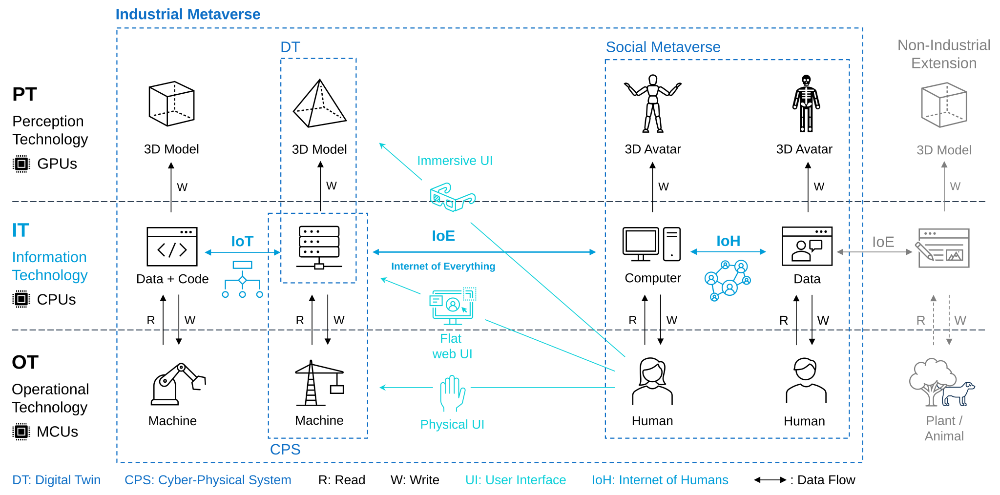

      

      <meta itemprop="image" content="img/regnath.jpg">
      

        
Emanuel Regnath

        
Software Architect

        

          <a href="https://siemens.com" target="_blank" style="text-decoration:none;">
          Siemens AG
          </a>
        

      

    

          <a class="intralink" href="/#research">Researcher</a>
         • <a class="intralink" href="/#projects">Developer</a>
         • <a class="intralink" href="/#parkour">Freerunner</a>
         • <a href="https://www.schachbund.de/verein/24430.html">Chess Player</a> 
         • Guitarist
    

    

        <a href="mailto:emanuel.regnath@tum.de" class="grow"><svg xmlns="http://www.w3.org/2000/svg" viewBox="0 0 512 512" style="fill:currentColor; width:1em; height:1em"><path d="M48 64C21.5 64 0 85.5 0 112c0 15.1 7.1 29.3 19.2 38.4L236.8 313.6c11.4 8.5 27 8.5 38.4 0L492.8 150.4c12.1-9.1 19.2-23.3 19.2-38.4c0-26.5-21.5-48-48-48L48 64zM0 176L0 384c0 35.3 28.7 64 64 64l384 0c35.3 0 64-28.7 64-64l0-208L294.4 339.2c-22.8 17.1-54 17.1-76.8 0L0 176z"/></svg></a>
        <a href="https://github.com/emareg" class="grow"><svg xmlns="http://www.w3.org/2000/svg" viewBox="0 0 496 512" style="fill:currentColor; width:1em; height:1em"><path d="M165.9 397.4c0 2-2.3 3.6-5.2 3.6-3.3.3-5.6-1.3-5.6-3.6 0-2 2.3-3.6 5.2-3.6 3-.3 5.6 1.3 5.6 3.6zm-31.1-4.5c-.7 2 1.3 4.3 4.3 4.9 2.6 1 5.6 0 6.2-2s-1.3-4.3-4.3-5.2c-2.6-.7-5.5.3-6.2 2.3zm44.2-1.7c-2.9.7-4.9 2.6-4.6 4.9.3 2 2.9 3.3 5.9 2.6 2.9-.7 4.9-2.6 4.6-4.6-.3-1.9-3-3.2-5.9-2.9zM244.8 8C106.1 8 0 113.3 0 252c0 110.9 69.8 205.8 169.5 239.2 12.8 2.3 17.3-5.6 17.3-12.1 0-6.2-.3-40.4-.3-61.4 0 0-70 15-84.7-29.8 0 0-11.4-29.1-27.8-36.6 0 0-22.9-15.7 1.6-15.4 0 0 24.9 2 38.6 25.8 21.9 38.6 58.6 27.5 72.9 20.9 2.3-16 8.8-27.1 16-33.7-55.9-6.2-112.3-14.3-112.3-110.5 0-27.5 7.6-41.3 23.6-58.9-2.6-6.5-11.1-33.3 2.6-67.9 20.9-6.5 69 27 69 27 20-5.6 41.5-8.5 62.8-8.5s42.8 2.9 62.8 8.5c0 0 48.1-33.6 69-27 13.7 34.7 5.2 61.4 2.6 67.9 16 17.7 25.8 31.5 25.8 58.9 0 96.5-58.9 104.2-114.8 110.5 9.2 7.9 17 22.9 17 46.4 0 33.7-.3 75.4-.3 83.6 0 6.5 4.6 14.4 17.3 12.1C428.2 457.8 496 362.9 496 252 496 113.3 383.5 8 244.8 8zM97.2 352.9c-1.3 1-1 3.3.7 5.2 1.6 1.6 3.9 2.3 5.2 1 1.3-1 1-3.3-.7-5.2-1.6-1.6-3.9-2.3-5.2-1zm-10.8-8.1c-.7 1.3.3 2.9 2.3 3.9 1.6 1 3.6.7 4.3-.7.7-1.3-.3-2.9-2.3-3.9-2-.6-3.6-.3-4.3.7zm32.4 35.6c-1.6 1.3-1 4.3 1.3 6.2 2.3 2.3 5.2 2.6 6.5 1 1.3-1.3.7-4.3-1.3-6.2-2.2-2.3-5.2-2.6-6.5-1zm-11.4-14.7c-1.6 1-1.6 3.6 0 5.9 1.6 2.3 4.3 3.3 5.6 2.3 1.6-1.3 1.6-3.9 0-6.2-1.4-2.3-4-3.3-5.6-2z"/></svg></a>
        <a href="https://www.linkedin.com/in/emareg" class="fa grow"><svg xmlns="http://www.w3.org/2000/svg" viewBox="0 0 448 512" style="fill:currentColor; width:1em; height:1em"><path d="M416 32H31.9C14.3 32 0 46.5 0 64.3v383.4C0 465.5 14.3 480 31.9 480H416c17.6 0 32-14.5 32-32.3V64.3c0-17.8-14.4-32.3-32-32.3zM135.4 416H69V202.2h66.5V416zm-33.2-243c-21.3 0-38.5-17.3-38.5-38.5S80.9 96 102.2 96c21.2 0 38.5 17.3 38.5 38.5 0 21.3-17.2 38.5-38.5 38.5zm282.1 243h-66.4V312c0-24.8-.5-56.7-34.5-56.7-34.6 0-39.9 27-39.9 54.9V416h-66.4V202.2h63.7v29.2h.9c8.9-16.8 30.6-34.5 62.9-34.5 67.2 0 79.7 44.3 79.7 101.9V416z"/></svg></a>
        <a href="https://scholar.google.de/citations?user=dTfPp2gAAAAJ" class="grow"><svg xmlns="http://www.w3.org/2000/svg" viewBox="0 0 512 512" style="fill:currentColor; width:1em; height:1em"><path d="M390.9 298.5c0 0 0 .1 .1 .1c9.2 19.4 14.4 41.1 14.4 64C405.3 445.1 338.5 512 256 512s-149.3-66.9-149.3-149.3c0-22.9 5.2-44.6 14.4-64h0c1.7-3.6 3.6-7.2 5.6-10.7c4.4-7.6 9.4-14.7 15-21.3c27.4-32.6 68.5-53.3 114.4-53.3c33.6 0 64.6 11.1 89.6 29.9c9.1 6.9 17.4 14.7 24.8 23.5c5.6 6.6 10.6 13.8 15 21.3c2 3.4 3.8 7 5.5 10.5zm26.4-18.8c-30.1-58.4-91-98.4-161.3-98.4s-131.2 40-161.3 98.4L0 202.7 256 0 512 202.7l-94.7 77.1z"/></svg></a> 
        <a href="https://www.researchgate.net/profile/Emanuel_Regnath" class="grow"><svg xmlns="http://www.w3.org/2000/svg" viewBox="0 0 448 512" style="fill:currentColor; width:1em; height:1em"><path d="M0 32v448h448V32H0zm262.2 334.4c-6.6 3-33.2 6-50-14.2-9.2-10.6-25.3-33.3-42.2-63.6-8.9 0-14.7 0-21.4-.6v46.4c0 23.5 6 21.2 25.8 23.9v8.1c-6.9-.3-23.1-.8-35.6-.8-13.1 0-26.1.6-33.6.8v-8.1c15.5-2.9 22-1.3 22-23.9V225c0-22.6-6.4-21-22-23.9V193c25.8 1 53.1-.6 70.9-.6 31.7 0 55.9 14.4 55.9 45.6 0 21.1-16.7 42.2-39.2 47.5 13.6 24.2 30 45.6 42.2 58.9 7.2 7.8 17.2 14.7 27.2 14.7v7.3zm22.9-135c-23.3 0-32.2-15.7-32.2-32.2V167c0-12.2 8.8-30.4 34-30.4s30.4 17.9 30.4 17.9l-10.7 7.2s-5.5-12.5-19.7-12.5c-7.9 0-19.7 7.3-19.7 19.7v26.8c0 13.4 6.6 23.3 17.9 23.3 14.1 0 21.5-10.9 21.5-26.8h-17.9v-10.7h30.4c0 20.5 4.7 49.9-34 49.9zm-116.5 44.7c-9.4 0-13.6-.3-20-.8v-69.7c6.4-.6 15-.6 22.5-.6 23.3 0 37.2 12.2 37.2 34.5 0 21.9-15 36.6-39.7 36.6z"/></svg></a> 
        <a href="https://orcid.org/0000-0002-0006-7761" class="grow"><svg xmlns="http://www.w3.org/2000/svg" viewBox="0 0 512 512" style="fill:currentColor; width:1em; height:1em"><path d="M294.75 188.19h-45.92V342h47.47c67.62 0 83.12-51.34 83.12-76.91 0-41.64-26.54-76.9-84.67-76.9zM256 8C119 8 8 119 8 256s111 248 248 248 248-111 248-248S393 8 256 8zm-80.79 360.76h-29.84v-207.5h29.84zm-14.92-231.14a19.57 19.57 0 1 1 19.57-19.57 19.64 19.64 0 0 1-19.57 19.57zM300 369h-81V161.26h80.6c76.73 0 110.44 54.83 110.44 103.85C410 318.39 368.38 369 300 369z"/></svg></a>
    

    
Hi, I am a Researcher and Software Architect. My interests are centered around connected cyber-physical systems (IoT, Industrial Metaverse), autonomous embedded systems (vehicles, drones), and cyber security (hashes, signatures). I like to solve problems on the protocol and data layer and to automate tasks with scripts because “where there is a shell, there is a way“.

Explore: [[info]], [[mind]]

## Research

I try to push digitalization towards the Internet of Things and Industrial Metaverse. My current focus is on trusted asset sharing, data interoperability, and verifiable credentials.

My vision is that at the end all system components fit together as shown in the following diagram:

### Publications

I try to push digitalization towards the Internet of Things and Industrial Metaverse. My current focus is on trusted asset sharing, data interoperability, and verifiable credentials.

My vision is that at the end all system components fit together as shown in the following diagram:

