

  

      

      <meta itemprop="image" content="img/regnath.jpg">
      

        
Emanuel Regnath

        
Software Scientist

        

          <a href="https://siemens.com" target="_blank" style="text-decoration:none;">
          Siemens AG
          </a>
        

      

  

  

    

          <a class="intralink" href="#research" data-noPopover="true">Researcher</a>
         • <a class="intralink" href="#projects">Developer</a>
         • <a class="intralink" href="/thoughts">Thinker</a>
         • <a class="intralink" href="/#parkour">Freerunner</a>
         • <a href="https://www.schachbund.de/verein/24430.html#:~:text=Regnath">Chess Player</a> 
         • Guitarist
    

    

        <a href="mailto:emanuel.regnath@tum.de" class="grow"><svg xmlns="http://www.w3.org/2000/svg" viewBox="0 0 512 512" style="fill:currentColor; width:1em; height:1em"><path d="M48 64C21.5 64 0 85.5 0 112c0 15.1 7.1 29.3 19.2 38.4L236.8 313.6c11.4 8.5 27 8.5 38.4 0L492.8 150.4c12.1-9.1 19.2-23.3 19.2-38.4c0-26.5-21.5-48-48-48L48 64zM0 176L0 384c0 35.3 28.7 64 64 64l384 0c35.3 0 64-28.7 64-64l0-208L294.4 339.2c-22.8 17.1-54 17.1-76.8 0L0 176z"/></svg></a>
        <a href="https://github.com/emareg" class="grow"><svg xmlns="http://www.w3.org/2000/svg" viewBox="0 0 496 512" style="fill:currentColor; width:1em; height:1em"><path d="M165.9 397.4c0 2-2.3 3.6-5.2 3.6-3.3.3-5.6-1.3-5.6-3.6 0-2 2.3-3.6 5.2-3.6 3-.3 5.6 1.3 5.6 3.6zm-31.1-4.5c-.7 2 1.3 4.3 4.3 4.9 2.6 1 5.6 0 6.2-2s-1.3-4.3-4.3-5.2c-2.6-.7-5.5.3-6.2 2.3zm44.2-1.7c-2.9.7-4.9 2.6-4.6 4.9.3 2 2.9 3.3 5.9 2.6 2.9-.7 4.9-2.6 4.6-4.6-.3-1.9-3-3.2-5.9-2.9zM244.8 8C106.1 8 0 113.3 0 252c0 110.9 69.8 205.8 169.5 239.2 12.8 2.3 17.3-5.6 17.3-12.1 0-6.2-.3-40.4-.3-61.4 0 0-70 15-84.7-29.8 0 0-11.4-29.1-27.8-36.6 0 0-22.9-15.7 1.6-15.4 0 0 24.9 2 38.6 25.8 21.9 38.6 58.6 27.5 72.9 20.9 2.3-16 8.8-27.1 16-33.7-55.9-6.2-112.3-14.3-112.3-110.5 0-27.5 7.6-41.3 23.6-58.9-2.6-6.5-11.1-33.3 2.6-67.9 20.9-6.5 69 27 69 27 20-5.6 41.5-8.5 62.8-8.5s42.8 2.9 62.8 8.5c0 0 48.1-33.6 69-27 13.7 34.7 5.2 61.4 2.6 67.9 16 17.7 25.8 31.5 25.8 58.9 0 96.5-58.9 104.2-114.8 110.5 9.2 7.9 17 22.9 17 46.4 0 33.7-.3 75.4-.3 83.6 0 6.5 4.6 14.4 17.3 12.1C428.2 457.8 496 362.9 496 252 496 113.3 383.5 8 244.8 8zM97.2 352.9c-1.3 1-1 3.3.7 5.2 1.6 1.6 3.9 2.3 5.2 1 1.3-1 1-3.3-.7-5.2-1.6-1.6-3.9-2.3-5.2-1zm-10.8-8.1c-.7 1.3.3 2.9 2.3 3.9 1.6 1 3.6.7 4.3-.7.7-1.3-.3-2.9-2.3-3.9-2-.6-3.6-.3-4.3.7zm32.4 35.6c-1.6 1.3-1 4.3 1.3 6.2 2.3 2.3 5.2 2.6 6.5 1 1.3-1.3.7-4.3-1.3-6.2-2.2-2.3-5.2-2.6-6.5-1zm-11.4-14.7c-1.6 1-1.6 3.6 0 5.9 1.6 2.3 4.3 3.3 5.6 2.3 1.6-1.3 1.6-3.9 0-6.2-1.4-2.3-4-3.3-5.6-2z"/></svg></a>
        <a href="https://www.linkedin.com/in/emareg" class="fa grow"><svg xmlns="http://www.w3.org/2000/svg" viewBox="0 0 448 512" style="fill:currentColor; width:1em; height:1em"><path d="M416 32H31.9C14.3 32 0 46.5 0 64.3v383.4C0 465.5 14.3 480 31.9 480H416c17.6 0 32-14.5 32-32.3V64.3c0-17.8-14.4-32.3-32-32.3zM135.4 416H69V202.2h66.5V416zm-33.2-243c-21.3 0-38.5-17.3-38.5-38.5S80.9 96 102.2 96c21.2 0 38.5 17.3 38.5 38.5 0 21.3-17.2 38.5-38.5 38.5zm282.1 243h-66.4V312c0-24.8-.5-56.7-34.5-56.7-34.6 0-39.9 27-39.9 54.9V416h-66.4V202.2h63.7v29.2h.9c8.9-16.8 30.6-34.5 62.9-34.5 67.2 0 79.7 44.3 79.7 101.9V416z"/></svg></a>
        <a href="https://scholar.google.de/citations?user=dTfPp2gAAAAJ" class="grow"><svg xmlns="http://www.w3.org/2000/svg" viewBox="0 0 512 512" style="fill:currentColor; width:1em; height:1em"><path d="M390.9 298.5c0 0 0 .1 .1 .1c9.2 19.4 14.4 41.1 14.4 64C405.3 445.1 338.5 512 256 512s-149.3-66.9-149.3-149.3c0-22.9 5.2-44.6 14.4-64h0c1.7-3.6 3.6-7.2 5.6-10.7c4.4-7.6 9.4-14.7 15-21.3c27.4-32.6 68.5-53.3 114.4-53.3c33.6 0 64.6 11.1 89.6 29.9c9.1 6.9 17.4 14.7 24.8 23.5c5.6 6.6 10.6 13.8 15 21.3c2 3.4 3.8 7 5.5 10.5zm26.4-18.8c-30.1-58.4-91-98.4-161.3-98.4s-131.2 40-161.3 98.4L0 202.7 256 0 512 202.7l-94.7 77.1z"/></svg></a> 
        <a href="https://www.researchgate.net/profile/Emanuel_Regnath" class="grow"><svg xmlns="http://www.w3.org/2000/svg" viewBox="0 0 448 512" style="fill:currentColor; width:1em; height:1em"><path d="M0 32v448h448V32H0zm262.2 334.4c-6.6 3-33.2 6-50-14.2-9.2-10.6-25.3-33.3-42.2-63.6-8.9 0-14.7 0-21.4-.6v46.4c0 23.5 6 21.2 25.8 23.9v8.1c-6.9-.3-23.1-.8-35.6-.8-13.1 0-26.1.6-33.6.8v-8.1c15.5-2.9 22-1.3 22-23.9V225c0-22.6-6.4-21-22-23.9V193c25.8 1 53.1-.6 70.9-.6 31.7 0 55.9 14.4 55.9 45.6 0 21.1-16.7 42.2-39.2 47.5 13.6 24.2 30 45.6 42.2 58.9 7.2 7.8 17.2 14.7 27.2 14.7v7.3zm22.9-135c-23.3 0-32.2-15.7-32.2-32.2V167c0-12.2 8.8-30.4 34-30.4s30.4 17.9 30.4 17.9l-10.7 7.2s-5.5-12.5-19.7-12.5c-7.9 0-19.7 7.3-19.7 19.7v26.8c0 13.4 6.6 23.3 17.9 23.3 14.1 0 21.5-10.9 21.5-26.8h-17.9v-10.7h30.4c0 20.5 4.7 49.9-34 49.9zm-116.5 44.7c-9.4 0-13.6-.3-20-.8v-69.7c6.4-.6 15-.6 22.5-.6 23.3 0 37.2 12.2 37.2 34.5 0 21.9-15 36.6-39.7 36.6z"/></svg></a> 
        <a href="https://orcid.org/0000-0002-0006-7761" class="grow"><svg xmlns="http://www.w3.org/2000/svg" viewBox="0 0 512 512" style="fill:currentColor; width:1em; height:1em"><path d="M294.75 188.19h-45.92V342h47.47c67.62 0 83.12-51.34 83.12-76.91 0-41.64-26.54-76.9-84.67-76.9zM256 8C119 8 8 119 8 256s111 248 248 248 248-111 248-248S393 8 256 8zm-80.79 360.76h-29.84v-207.5h29.84zm-14.92-231.14a19.57 19.57 0 1 1 19.57-19.57 19.64 19.64 0 0 1-19.57 19.57zM300 369h-81V161.26h80.6c76.73 0 110.44 54.83 110.44 103.85C410 318.39 368.38 369 300 369z"/></svg></a>
    

    
Hi, I am a Researcher and Software Architect. My interests are centered around connected cyber-physical systems (IoT, Industrial Metaverse), autonomous embedded systems (vehicles, drones), and cyber security (hashes, signatures). I like to solve problems on the protocol and data layer and to automate tasks with scripts because “where there is a shell, there is a way“.

  

My main activities are:</a>

  <a href="/#research" class="nopopover">
    
    <h4>Publish Research</h4>
  </a>
  
Scientific insights for the Internet of Things and Industrial Metaverse. Also check my Ph.D. Thesis.

  <a href="/projects/" class="nopopover">
    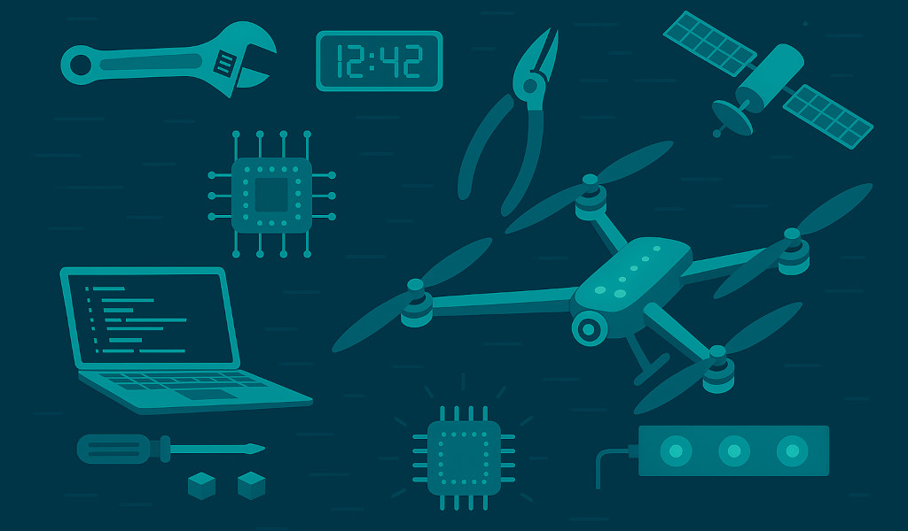</img>
    <h4>Build Projects</h4>
  </a>
  
From drones and clocks to automation scripts and small software tools. I like to create interactive stuff.

  <a href="/thoughts/">
    </img>
    <h4>Grow Thoughts</h4>
  </a>
  
A digital garden, where I collect ideas & thoughts about <a href="/thoughts/tech">technology</a>, the <a href="/thoughts/mind">philosophy</a>, and <a href="/thoughts/society">society</a>.

 <a href="/#hobbies">
  </img>
  <h4>Play Hobbies</h4>
 </a>
 
In my spare time I like to explore Sports, Music, and Games.

   

## Research

I try to push digitalization towards the Internet of Things and Industrial Metaverse. My current focus is on trusted asset sharing, data interoperability, and verifiable credentials.

My vision is that at the end all system components fit together as shown in the following diagram:

### Publications

  <ul class="pub-list fa-ul lh-11">
    <li>
      

        <a href="https://dx.doi.org/10.1109/COINS51742.2021.9524266">CISCAV: Consensus-based Intersection Scheduling for Connected Autonomous Vehicles</a>
        
<small><strong>Emanuel Regnath</strong>, Markus Birkner, Sebastian Steinhorst</small>

        
<small>IEEE International Conference on Omni-Layer Intelligent Systems (COINS), Virtual, 2021</small>

        
<small><a href="https://emanuel.regnath.info/bib/rbs:2021.txt"><button>BibTeX</button></a></small>

      

    </li>
    <li>
      

        <a href="https://dx.doi.org/10.1109/ICBC51069.2021.9461082">A-PoA: Anonymous Proof of Authorization for Decentralized Identity Management</a>
        
<small>Jan Lauinger, Jens Ernstberger, <strong>Emanuel Regnath</strong>, Mohammad Hamad, Sebastian Steinhorst</small>

        
<small>IEEE International Conference on Blockchain and Cryptocurrency (ICBC 2021), Sydney, Australia, 2021</small>

        
<small><a href="https://emanuel.regnath.info/bib/apoa2021.txt"><button>BibTeX</button></a></small>

      

    </li>
    <li>
      

        <a href="https://dx.doi.org/10.23919/DATE51398.2021.9474070">SPPS: Secure Policy-based Publish/Subscribe System for V2C Communication</a>
        
<small>Mohammad Hamad, <strong>Emanuel Regnath</strong>, Jan Lauinger, Vassilis Prevelakis, Sebastian Steinhorst</small>

        
<small>Proceedings of the Conference on Design, Automation and Test in Europe (DATE 2021), Grenoble, France, 2021</small>

        
<small><a href="https://emanuel.regnath.info/bib/spps2021.txt"><button>BibTeX</button></a></small>

      

    </li>
    <li>
      

        <a href="https://dx.doi.org/10.1109/COINS49042.2020.9191420">Blockchain, what time is it? Trustless Datetime Synchronization for IoT</a>
        
<small><strong>Emanuel Regnath</strong>, Nitin Shivaraman, Shanker Shreejith, Arvind Easwaran, Sebastian Steinhorst</small>

        
<small>IEEE International Conference on Omni-layer Intelligent Systems (COINS 2020), Barcelona, Spain, 2020</small>

        
<small><a href="https://emanuel.regnath.info/pdf/2020-Blockchain_Datetime_Synchronization.pdf"><button>PDF</button></a> <a href="https://emanuel.regnath.info/bib/bcsync2020.txt"><button>BibTeX</button></a></small>

      

    </li>
    <li>
      

        <a href="https://dx.doi.org/10.23919/DATE48585.2020.9116517">AMSA: Adaptive Merkle Signature Architecture</a>
        
<small><strong>Emanuel Regnath</strong>, Sebastian Steinhorst</small>

        
<small>Proceedings of the Conference on Design, Automation and Test in Europe (DATE 2020), Grenoble, France, 2020</small>

        
<small><a href="https://emanuel.regnath.info/pdf/2020-AMSA_Hash_Signatures.pdf"><button>PDF</button></a> <a href="https://emanuel.regnath.info/bib/amsa2020.txt"><button>BibTeX</button></a></small>

      

    </li>
    <li>
      

        <a href="https://dx.doi.org/10.1145/3240765.3240820">LeapChain: Efficient Blockchain Verification for Embedded IoT</a>
        
<small><strong>Emanuel Regnath</strong>, Sebastian Steinhorst</small>

        
<small>ACM International Conference on Computer-Aided Design (ICCAD), San Diego, CA, USA, 2018</small>

        
<small><a href="https://emanuel.regnath.info/pdf/2018-LeapChain.pdf"><button>PDF</button></a> <a href="https://emanuel.regnath.info/bib/leapchain.txt"><button>BibTeX</button></a></small>

      

    </li>
    <li>
      

        <a href="https://dx.doi.org/10.1109/FDL.2018.8524068">SmaCoNat: Smart Contracts in Natural Language</a>
        
<small><strong>Emanuel Regnath</strong>, Sebastian Steinhorst</small>

        
<small>Forum on specification and Design Languages (FDL), Munich, Germany, 2018</small>

        
<small><a href="https://emanuel.regnath.info/pdf/2018-SmaCoNat.pdf"><button>PDF</button></a> <a href="https://emanuel.regnath.info/bib/smaconat.txt"><button>BibTeX</button></a></small>

      

    </li>
    <li>
      

         <a href="https://dx.doi.org/978-3-319-66266-4">Development and Verification of a Flight Stack for a High-Altitude Glider in Ada/SPARK 2014</a>
        
<small>Martin Becker, <strong>Emanuel Regnath</strong>, Samarjit Chakraborty</small>

        
<small>36th International Conference on Computer Safety, Reliability and Security (SAFECOMP), Trento, Italy, 2017</small>

        
<small><a href="https://emanuel.regnath.info/pdf/2017-Spark_Glider.pdf"><button>PDF</button></a> <a href="https://emanuel.regnath.info/bib/spark_glider.txt"><button>BibTeX</button></a></small>

      

    </li>
    <li>
      

        <a href="https://dx.doi.org/10.1109/RTCSA.2015.21">Smart2: Smart Charging for Smart Phones</a>
        
<small>Alma Pröbstl, Philipp Kindt, <strong>Emanuel Regnath</strong>, Samarjit Chakraborty</small>

        
<small>IEEE 21st International Conference on Embedded and Real-Time Computing Systems and Applications (RTCSA), 2015</small>

        
<small><a href="https://emanuel.regnath.info/pdf/2015-Smart_Charger.pdf"><button>PDF</button></a> <a href="https://emanuel.regnath.info/bib/smart2_charger.txt"><button>BibTeX</button></a></small>

      

    </li>
  </ul>

### Projects

<small>Ideas come to life</small>

  

    <a href="https://id2.dev">
      
      <h4>ID2 Identifiers</h4>
    </a>
    
A universal notation scheme for over 100 identifiers, such as DOI, EAN, or crypto-addresses.

  

  

    <a href="https://github.com/emareg/acamedic">
      
      <h4>Acamedic</h4>
    </a>
  
Academic Dictionary for Scientific Writing in American English.

  

  

    <a href="https://tex4tum.de">
      
      <h4>Tex4TUM</h4>
    </a>
    
Interactive Knowledge Platform for Students.

  

  

    <a href="/projects/tesserakt">
      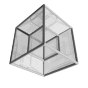
      <h4>Tesserakt</h4>
    </a>
    
Simulation of a Four-Dimensional Hypercube.

  

  

    <a href="https://classless.de">
      
      <h4>Classless.css</h4>
    </a>
    
Minimal CSS3 framework with few but great styles for basic HTML tags.

  

  

    <a href="https://github.com/emareg/unikeyboard">
      
      <h4>Unikeyboard</h4>
    </a>
    
German XKB keyboard layout with 8 levels for often used unicode characters.

  

  

    <a href="https://github.com/emareg/paper-checker">
      
      <h4>Paper-Checker</h4>
    </a>
    
Python script that checks english texts for grammar mistakes.

  

  

  <a href="https://github.com/emareg/promptheus">
    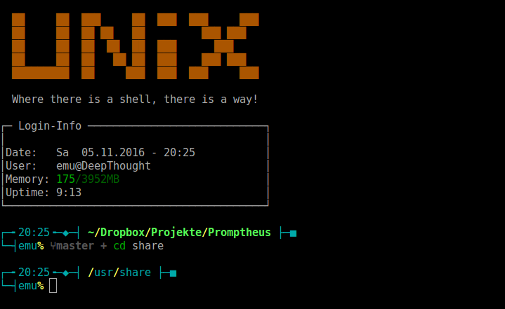
    <h4>Promptheus</h4>
  </a>
  
A bash/zsh/fish prompt with the power of a Titan.

  

  

    <a href="/thoughts/">
      
      <h4>My 2nd Brain</h4>
    </a>
    
A “digital garden” with <a href="https://obsidian.md">Obsidian</a> & <a href="https://quartz.jzhao.xyz/">Quartz</a>.

  

  

    <a href="/projects/binaryclock">
      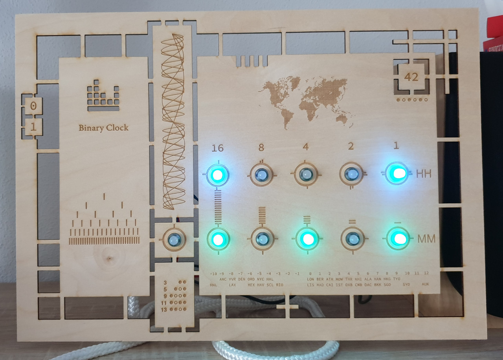
      <h4>Binary Clock</h4>
    </a>
    
Display date and time – NERD style.

  

  

  <a href="/projects/spark_glider">
    
    <h4>High-Altitude Glider</h4>
  </a>
  
Flight stack written in Ada/SPARK 2014.

  

## Hobbies

In my spare time I like to do sports, play guitar, or games.

<h3 id="parkour">Parkour and Freerunning</h3>

Since 2008 I work as a coach for Parkour and Freerunning with children and young adults. I try to motivate them for these trend-sports that focus on body control and help to touch physical limits without any competitive spirit.  
Check out the hompage of [TSV-Herrsching](https://www.tsv-herrsching.de/gymnastik_turnen/freestyle-parkour-akrobatik/#training).

<figure class="col-4">
 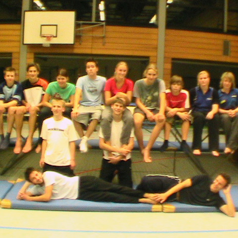
 <figcaption>Indoor Training</h4></figcaption>
</figure>

<figure class="col-4">
 
 <figcaption>Trampoline Hall</h4></figcaption>
</figure>

<figure class="col-4">
 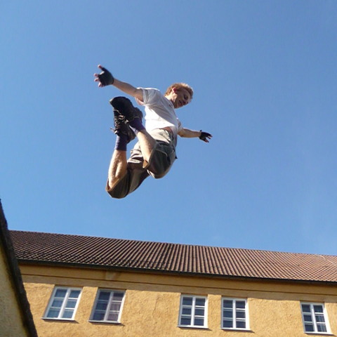
 <figcaption>Outdoor</h4></figcaption>
</figure>

### Other Sports
I also enjoy trying all other sorts of sports.

  

  <figure class="col">
    
    <figcaption>Skiing</figcaption>
  </figure>
  <figure class="col">
    <a href="/hobbies/windsurfing">
      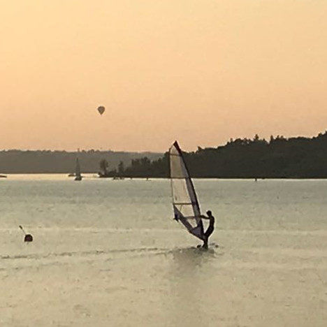
      <figcaption>Wind Surfing</figcaption>
    </a>
  </figure>

  

  

    <figure class="col">
      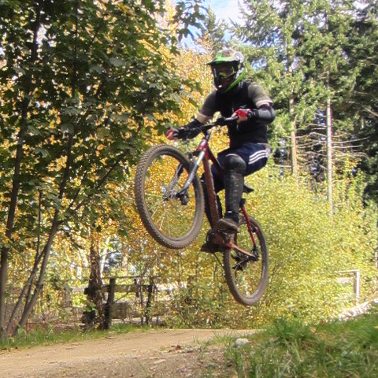
      <figcaption>Mountain Biking</figcaption>
    </figure>
    <figure class="col">
      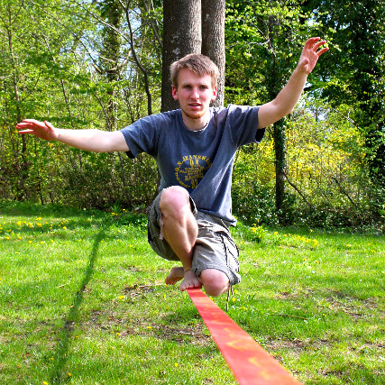
      <figcaption>Slackline</figcaption>
    </figure>

  

  

    <figure class="col">
      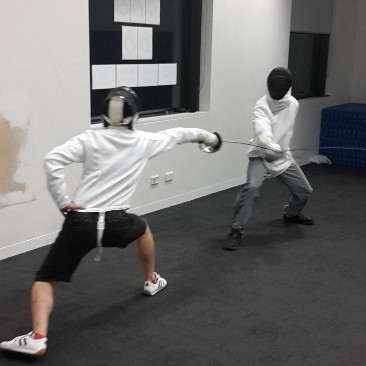
      <figcaption>Fencing</figcaption>
    </figure>
    <figure class="col">
      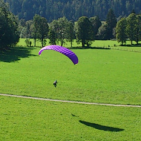
      <figcaption>Paragliding</figcaption>
    </figure>
  

  

    <figure class="col">
      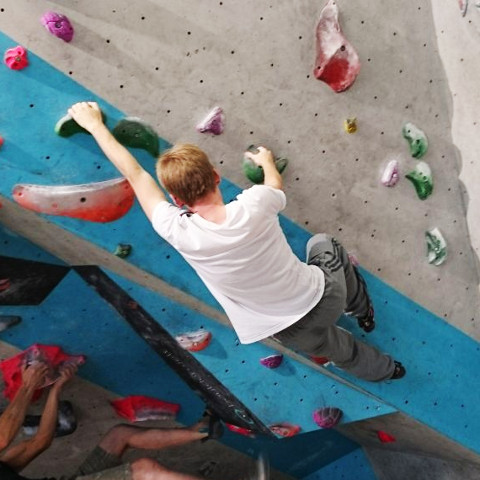
      <figcaption>Bouldering</figcaption>
    </figure>
    <figure class="col">
      
      <figcaption>Wave Surfing</figcaption>
    </figure>
  

